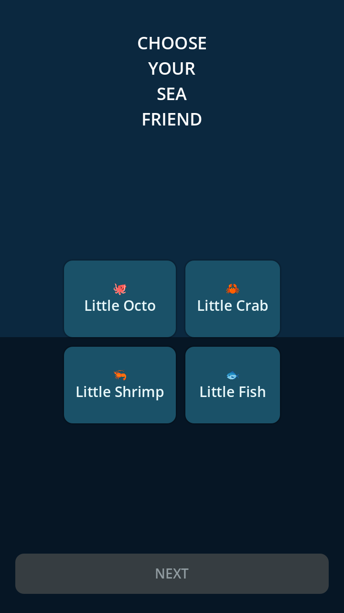
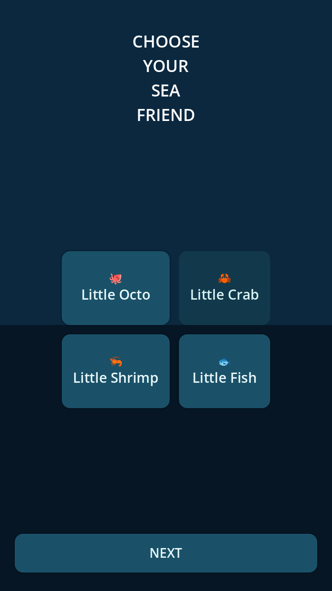
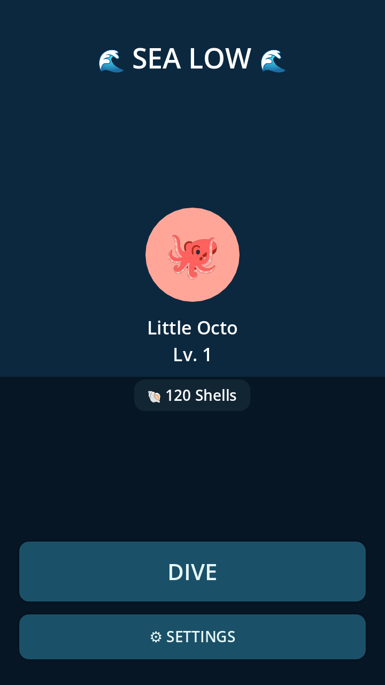
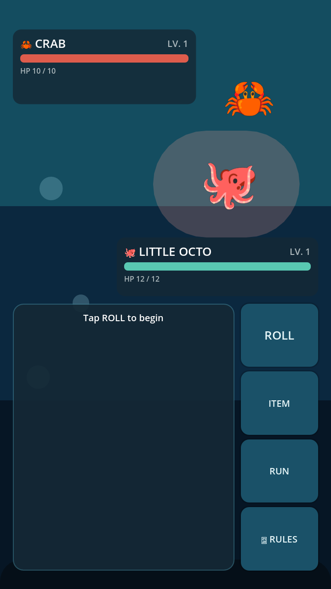
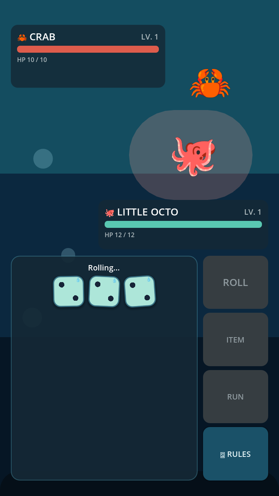
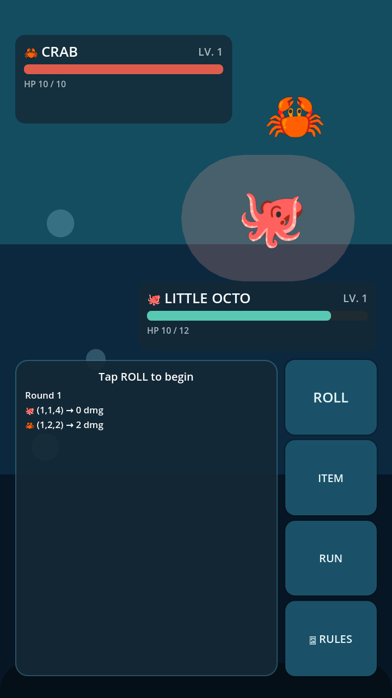
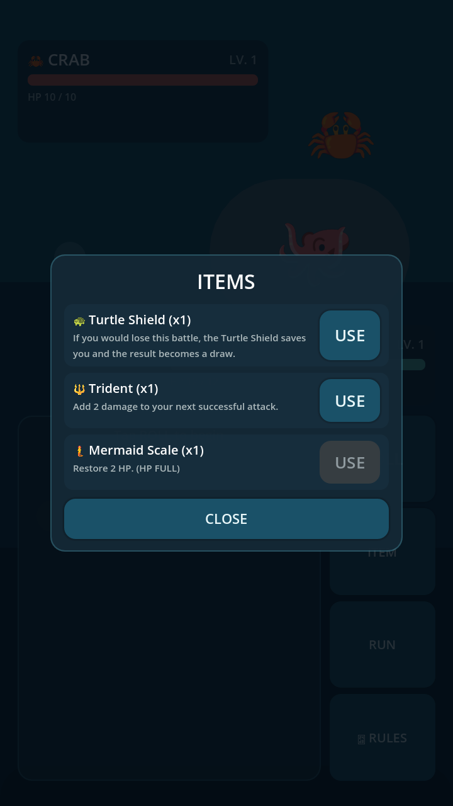
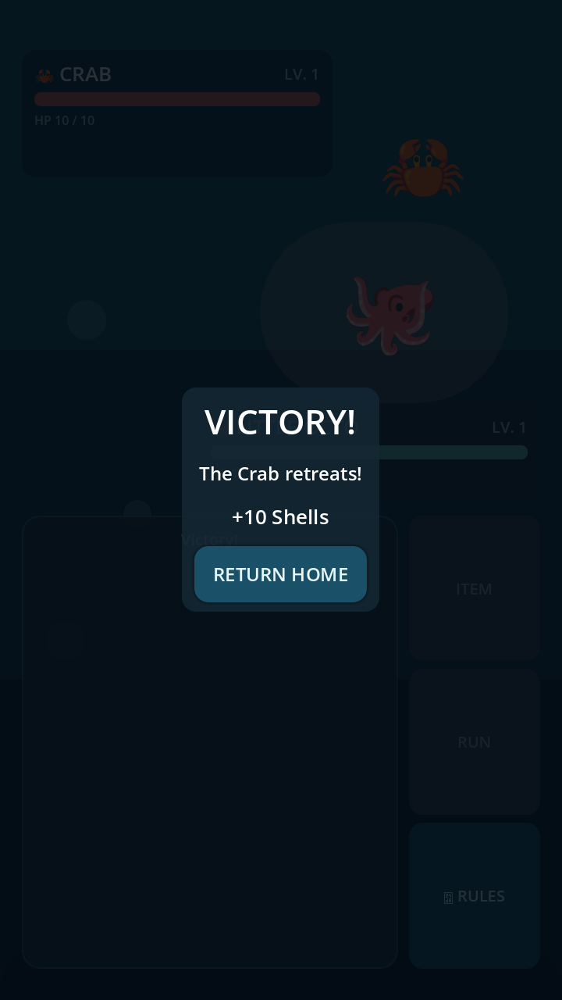

# SeaLow — User Guide (v0.2)

A quick walkthrough of the SeaLow ocean dice battler, with screenshots from
the current build.

## 1. First launch: Character Select

The very first time you play (or after deleting your save file), SeaLow
asks you to pick your sea friend before showing the Main Menu.

**Step 1 — choose a creature:**

🐙 Octopus · 🦀 Crab · 🦐 Shrimp · 🐟 Fish

**Step 2 — choose a pastel color:**

Seafoam, Coral, Lavender, Baby Blue, Peach, Mint, Soft Pink, and Sunny
Yellow swatches are shown as large circles. The preview updates live as
you tap a swatch.

Press **START YOUR DIVE** to confirm. Your creature and color are saved
immediately, so you won't see this screen again on future launches.

## 2. Main Menu

The Main Menu shows your selected creature, its display name ("Little
Octo", "Little Crab", "Little Shrimp", or "Little Fish"), level, and your
shell total.

Press **DIVE** to enter a battle against the Crab.

## 3. Battle screen

The Crab (enemy) is shown at the top with its HP bar; your creature is
shown below with its own HP bar. The bottom panel holds the dice, a
compact battle log, and the action buttons: **ROLL**, **ITEM**, **RUN**,
**RULES**.

### Rolling dice

Press **ROLL** to roll three large, ocean-themed dice. Each die spins
through random faces, gradually slows down, and settles on its final
value over roughly 1.2–1.6 seconds — long enough to feel satisfying
without freezing the UI.

Once both sides have rolled, the result is added to the **compact battle
log** (for example `Round 1 / 🐙 15 (5,5,5) → 3 dmg`), keeping the newest
rounds visible and scrollable.

### Using items

Press **ITEM** to open the item popup. You start with one of each:

- 🐢 **Turtle Shield** — arms a one-time save. If you would lose the
  battle while it's armed, the result becomes a **DRAW** instead of a
  defeat (the shield is consumed either way once triggered).
- 🔱 **Trident** — arms a +2 damage bonus for your *next* successful hit,
  then is consumed.
- 🧜 **Mermaid Scale** — instantly restores 2 HP (capped at your max HP)
  and is consumed. Disabled automatically if you're already at full HP.

### Winning

When the Crab's HP reaches 0, you win the battle and earn shells.

If your Turtle Shield saves you from what would otherwise be a defeat,
you'll instead see a **DRAW** result — the Crab is not counted as
defeated, and you return home with your other progress unaffected.

## 4. Progress is saved automatically

Your selected creature, color, level, shells, battles won, and item
inventory are saved to disk right after:

- creating your character
- winning a battle
- using or receiving an item

You can safely quit and relaunch SeaLow at any point — everything above
will be exactly as you left it. Save data lives at `user://sealow_save.json`
(a JSON file), which on desktop platforms typically maps to a path like
`~/.local/share/godot/app_userdata/SeaLow/sealow_save.json` (Linux),
`%APPDATA%\Godot\app_userdata\SeaLow\sealow_save.json` (Windows), or
`~/Library/Application Support/Godot/app_userdata/SeaLow/sealow_save.json`
(macOS). Deleting that file resets the game to a first-time install.
